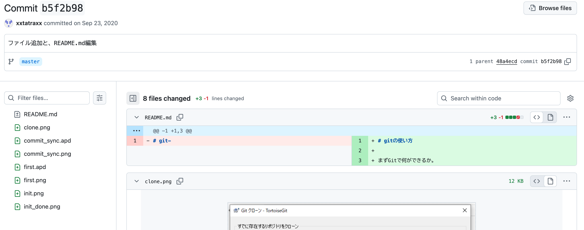

# gitの使い方
[旧版](./old/README.md)

 - git自体の話
   - gitサーバーの話
 - GitHubなどのホスティングサービスの話
 - GitHubDesktop などのクライアント及びローカルマネージャーの話

 1. [そもそもgitとは](#そもそもgitとは)
 1. [なぜ GitHub を使う？](#なぜgithubを使う)
 1. [おすすめのGitクライアント](#おすすめのgitクライアント)

## そもそもgitとは

バージョン管理システム = 誰が、何を、いつ、どう、変更したかを管理するツールです。

注意：GitとGitHubは全く別物

### プログラミング以外にも使える

メモや小説、その他ドキュメントの管理もできる

### git は それ単体でサーバー機能を提供できます。

GitHub などのサービスを使わなくても、完全ローカルや、社内や家庭内などのローカルネットワークでも使う事ができます。

## なぜGitHubを使う？

みんな使ってる = 情報量が多い

他のマシンからも参照できる

自分でサーバーを立てるのは大変

追加機能が豊富

issues(問題、やる事)の管理、

milestone(予定の管理)、

discussion(ここはこうしたほうが、こういうのがあったら便利ではないか？など)

# 個人的おすすめのGitクライアント

[VSCode](https://code.visualstudio.com/)

[Git Graph](https://marketplace.visualstudio.com/items?itemName=mhutchie.git-graph) ( VSCode 拡張機能 )

[TortoiseGit](https://tortoisegit.org/)　( Win用 日本語パックのダウンロードも忘れずに )

他にも様々なGitクライアントがあるので、自分にあった物を探すと良いと思います。

