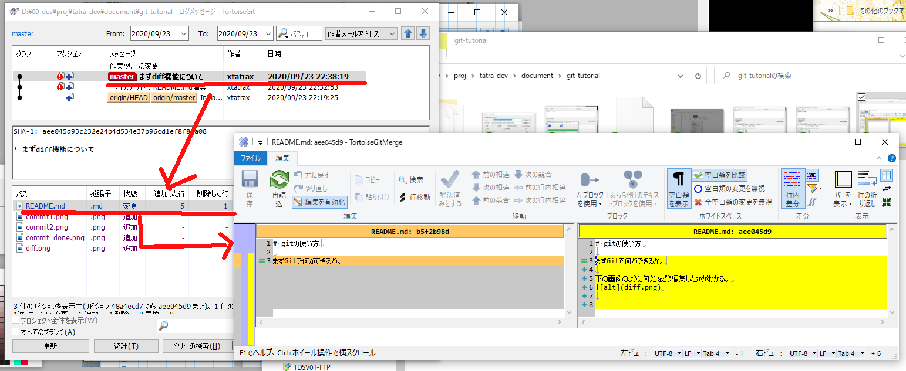
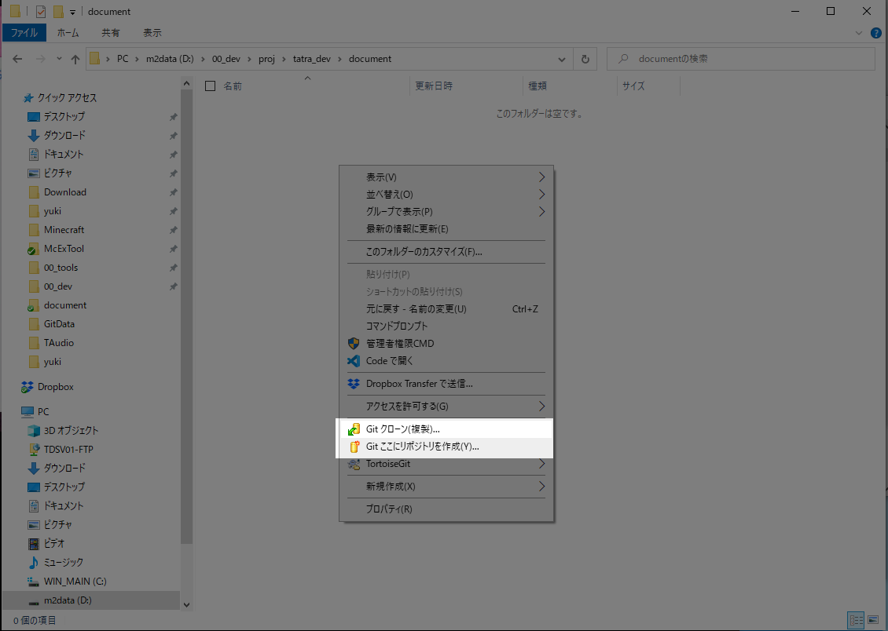

# gitの使い方

本ドキュメントは、Git及びTortoiseGitがインストールされている前提で話を進めます。まだ入れてない人は、以下のURLよりインストール  
Git : [https://git-scm.com/](https://git-scm.com/)  
TortoiseGit : [https://tortoisegit.org/](https://tortoisegit.org/)

# #まずGitで何ができるか。
 

## #下の画像のように何処をどう編集したかがわかる。

 
 

## また、いつ、誰が、どのファイルの、何処を、どんな編集をしたかも確認できる。

# #では簡単なGitの使い方。

## まずは、既存のリポジトリをクローンしてみましょう。  
※ リポジトリとか、クローンとかの説明は後ほど。  
※ とりあえず単語だけ頭の片隅においておきましょう。・ｗ・。

 

## #プロジェクトを保存する作業ディレクトリを決めましょう。
＊ 筆者の場合、次のディレクトリを作業場所としました。 D:\00_dev\proj\tatra_dev\document\
＊ あくまで、筆者の場合なので、自分の使いやすい場所を適当に選べばいいと思います。

### 作業ディレクトリを決めたら、右クリックから、
#### [ git ここにリポジトリを作成(Y)… ]を選択

こんな画面が出る。